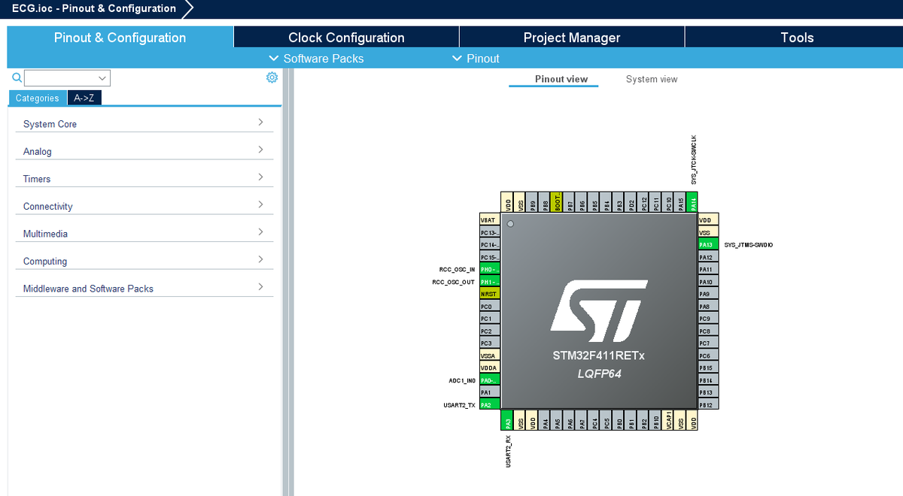
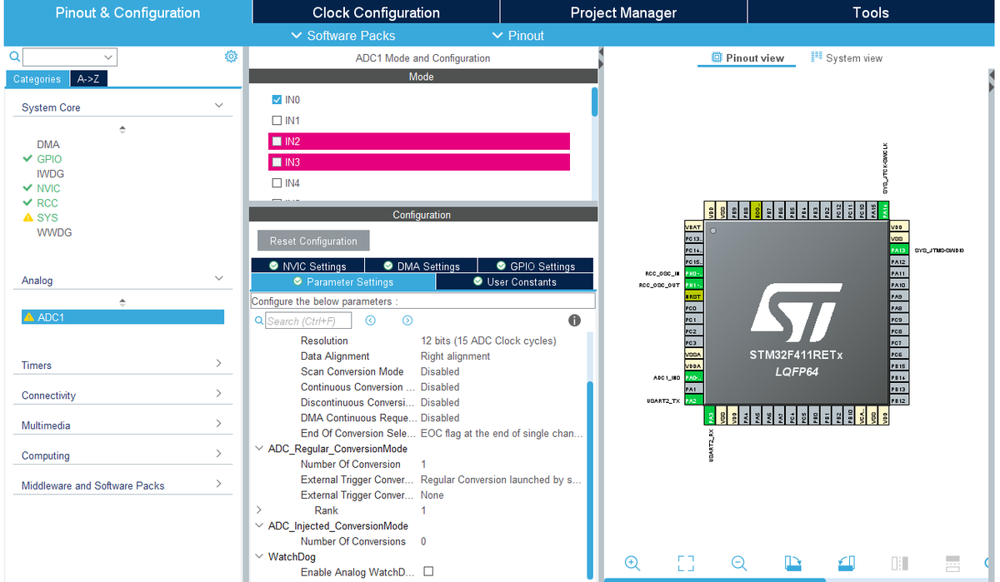

# 01. Experiment, Hardware, and Firmware

## 1. 문서 목적
이 문서는 **실험 환경 → PPG 아날로그 회로 → STM32CubeMX 설정 → STM32 펌웨어 신호처리 → peak 검출 → IBI/UART 출력**까지를 하나의 흐름으로 설명합니다.  
이 프로젝트는 Raspberry Pi 기반이 아니라 **STM32F411RETx 기반 PPG 수집 및 처리 프로젝트**입니다.

핵심은 다음입니다.

> 귓불 PPG 센서가 만든 아날로그 신호를 회로가 증폭/정형하고, STM32가 이를 ADC로 읽은 뒤, 이동평균·IIR 필터·적응형 threshold·미분 기반 FSM을 통해 IBI를 만들어 Python HRV 파이프라인으로 넘긴다.

---

## 2. 실험 환경

### 2-1. 실험 사진
| 귓불 PPG 센서 | 전체 실험 장면 |
|---|---|
|  |  |

| N-back 화면 | 피험자 측면 | 파형 모니터링 |
|---|---|---|
|  |  |  |

### 2-2. 실험 시나리오
1. 피험자는 귓불에 PPG 센서를 부착합니다.
2. STM32 보드와 PPG 아날로그 회로가 PPG 신호를 수집합니다.
3. 피험자는 모니터에 제시되는 N-back 과제를 수행합니다.
4. STM32 펌웨어는 실시간으로 PPG peak와 IBI를 계산합니다.
5. UART로 `filtered_ppg,ibi_ms` 형식의 데이터를 PC에 전송합니다.
6. Python 코드가 IBI를 HRV 특징으로 변환하고, N-back 결과를 라벨로 사용합니다.

### 2-3. N-back 결과와 label 연결
<p align="center"></p>

N-back 결과 화면은 단순 참고 이미지가 아니라, Python 학습 라벨의 출발점입니다.  
즉, **PPG/HRV는 입력 X**이고, **N-back accuracy 기반 High/Low는 target y**입니다.

---

## 3. 하드웨어 구성

### 3-1. 하드웨어 전체 개요
<p align="center"></p>

### 3-2. PPG 아날로그 회로도
<p align="center"></p>

### 3-3. PPG 회로가 필요한 이유
<p align="center"></p>

PPG 센서는 혈류 변화에 따른 광량 변화를 전기 신호로 바꾸지만, 이 신호는 매우 작고 잡음에 취약합니다. 따라서 STM32 ADC에 직접 넣으면 다음 문제가 생깁니다.

- 신호 진폭이 작아 ADC 분해능을 충분히 활용하지 못함
- DC baseline drift가 커서 peak 검출 기준이 흔들림
- 움직임/주변광/배선 노이즈로 false peak가 생길 수 있음
- ADC 입력 범위와 신호 중심점이 맞지 않으면 clipping 또는 resolution 손실 발생

따라서 회로는 다음 역할을 수행합니다.

| 회로 블록 | 역할 | STM32 처리와의 연결 |
|---|---|---|
| LED / photodiode | 혈류 변화에 따른 광학 신호 취득 | pulse waveform의 원천 |
| op-amp gain stage | 미세 신호 증폭 | ADC가 읽을 수 있는 전압 범위 확보 |
| RC network | 저주파 drift / 고주파 noise 완화 | 디지털 필터 부담 감소 |
| bias / buffer | ADC 입력 안정화 | STM32 ADC1 입력으로 전달 |

---

## 4. STM32CubeMX 설정

### 4-1. 주요 설정 요약
업로드된 코드와 설정 스크린샷을 기준으로 한 핵심 설정은 다음과 같습니다.

| 항목 | 설정 / 의미 |
|---|---|
| MCU | `STM32F411RETx` |
| ADC | ADC1, 12-bit, regular conversion, software trigger |
| ADC 입력 | PPG analog channel |
| TIM1 | 주기적 타이밍 설정용, prescaler = 999, period = 999 |
| TIM2 | microsecond timestamp용, prescaler = 83 |
| USART2 | 115200 baud, UART 출력 |
| Clock | HSE bypass + PLL, SYSCLK 100 MHz |

### 4-2. 증빙 스크린샷
| Pinout | Project tree |
|---|---|
|  |  |

| ADC1 channel | ADC1 parameters |
|---|---|
|  |  |

| TIM1 | USART2 |
|---|---|
|  |  |

| RCC | Clock configuration |
|---|---|
|  |  |

---

## 5. 펌웨어 전체 처리 흐름
<p align="center"></p>

이 그림은 STM32 코드의 전체 신호처리 흐름입니다.

```text
ADC acquisition
→ ADC-to-voltage conversion
→ 5-point moving average
→ CMSIS-DSP IIR biquad cascade
→ adaptive envelope threshold
→ derivative-based FSM peak detector
→ IBI validation
→ UART output
```

---

## 6. 각 알고리즘별 개념 / 공식 / 사용 이유

<p align="center"></p>

### 6-1. ADC count → voltage
#### 개념
ADC는 실제 전압을 정수 count로 변환합니다. STM32F411RE의 12-bit ADC는 `0~4095` 범위를 사용합니다.

#### 공식
`V[n] = ADC[n] × 3.3 / 4095`

#### 왜 필요한가
ADC count 그대로는 물리적 단위가 없기 때문에, 회로 출력이 실제로 어느 전압 범위에 있는지 판단하기 어렵습니다. 전압 변환은 신호 크기와 saturation 여부를 해석하는 기준이 됩니다.

---

### 6-2. 5-point moving average
#### 개념
최근 5개의 샘플 평균을 사용해 순간적인 jitter를 완화합니다.

#### 공식
`y[n] = (1/5) · Σ[k=0..4] x[n-k]`

#### 코드 연결
`numReadings = 5`

#### 왜 필요한가
PPG peak detector는 기울기와 threshold를 사용하기 때문에, 샘플 단위 잡음이 크면 false peak가 생길 수 있습니다. 이동평균은 IIR 필터 전 단계에서 random jitter를 줄이는 역할을 합니다.

---

### 6-3. CMSIS-DSP IIR biquad cascade
#### 개념
펌웨어는 `arm_biquad_cascade_df2T_f32()`를 이용해 2-stage biquad 필터를 적용합니다.

#### 일반적 차분식
`y[n] = b0x[n] + b1x[n-1] + b2x[n-2] + a1y[n-1] + a2y[n-2]`

#### 코드 연결
- 함수: `arm_biquad_cascade_df2T_f32()`
- 의도: 0.5 Hz HPF + 8 Hz LPF 계열의 PPG 대역 추출

#### 왜 필요한가
PPG에는 느린 baseline drift와 빠른 고주파 잡음이 모두 섞입니다. IIR band-pass 처리는 peak 검출에 필요한 맥파 성분만 남기기 위한 핵심 단계입니다.

---

### 6-4. Adaptive envelope threshold
#### 개념
고정 threshold는 센서 부착 상태와 진폭 변화에 취약합니다. 그래서 필터 출력의 envelope를 따라가는 동적 threshold를 사용합니다.

#### 공식
상승 시:
`env[n] = a_up·|x[n]| + (1-a_up)·env[n-1]`

하강 시:
`env[n] = a_dn·|x[n]| + (1-a_dn)·env[n-1]`

threshold:
`thr[n] = K · env[n]`

#### 코드 파라미터
- `a_up = 0.40`
- `a_dn = 0.02`
- `K = 0.15`

#### 왜 필요한가
맥파 진폭은 측정 중에도 달라질 수 있습니다. Adaptive threshold는 신호 진폭 변화에 맞춰 검출 기준을 자동 조정합니다.

---

### 6-5. Derivative-based FSM peak detector
<p align="center"></p>

#### 개념
단순히 threshold를 넘었다고 peak로 인정하면 오검출이 많습니다. 이 코드는 threshold, 1차 미분, 2차 미분, refractory 조건을 함께 사용합니다.

#### 공식
1차 미분:
`der1[n] = x[n] - x[n-1]`

2차 미분:
`der2[n] = der1[n] - der1[n-1]`

#### 상태
| 상태 | 의미 |
|---|---|
| `ST_IDLE` | 상승 시작을 기다리는 상태 |
| `ST_RISING` | 신호가 상승 중인 상태 |
| `ST_SLOPEMAXED` | 기울기 최대점을 지난 뒤 peak를 기다리는 상태 |
| `PEAK event` | 유효 peak 확정 및 IBI 계산 |

#### 왜 필요한가
PPG peak는 단순 threshold crossing이 아니라, 상승-감속-하강의 형태를 갖습니다. 미분 기반 FSM은 이러한 형태적 조건을 사용해 false peak를 줄입니다.

---

### 6-6. Refractory period와 IBI validation
#### 개념
심장 박동은 생리적으로 가능한 최소 간격이 있습니다. peak가 너무 자주 검출되면 잡음일 가능성이 큽니다.

#### 코드 조건
- `REFRACTORY_US = 300000`
- `IBI_MIN_MS = 250`
- `IBI_MAX_MS = 2000`

#### IBI 공식
`IBI_ms = (t_peak,i - t_peak,i-1) / 1000`

#### 왜 필요한가
짧은 시간 안에 반복되는 peak는 보통 noise, ringing, threshold artifact일 수 있습니다. IBI validation은 HRV 계산에 들어가는 interval 품질을 지키는 방어선입니다.

---

### 6-7. UART 출력 포맷
#### 개념
STM32는 PC로 필터링된 PPG와 IBI를 CSV 형태로 전송합니다.

#### 포맷
- peak 시: `filtered_ppg,ibi_ms`
- 비-peak 시: `filtered_ppg,0`

#### 왜 필요한가
이 포맷 덕분에 Python은 한 파일에서 PPG waveform과 IBI event를 동시에 읽을 수 있습니다. 즉, STM32 펌웨어는 단순 수집기가 아니라 **Python HRV pipeline을 위한 전처리 front-end**입니다.

---

## 7. 이 문서의 핵심 해석
STM32 코드는 단순히 ADC 값을 저장하는 코드가 아닙니다.  
회로가 만든 PPG 파형을 **디지털 필터링하고, peak를 판단하고, 유효 IBI만 선별해 Python 파이프라인으로 넘기는 실시간 생체신호 전처리기**입니다.

따라서 전체 연구 흐름에서 STM32 파트의 의미는 다음과 같습니다.

> **아날로그 PPG 신호를 신뢰 가능한 IBI stream으로 변환하는 하드웨어-펌웨어 계층**
